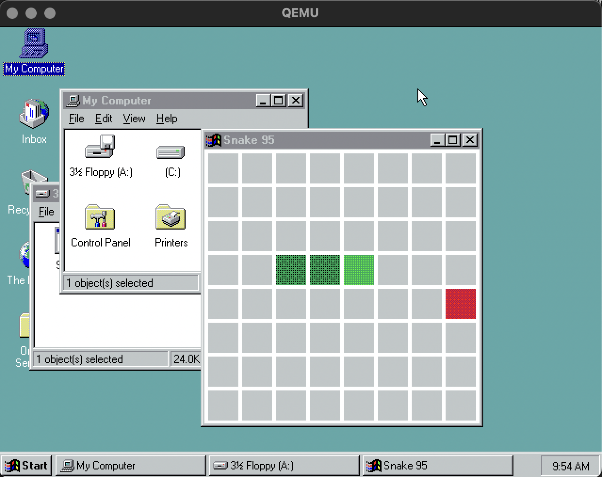

# Snake for Windows 95

A classic Snake game written in C for Windows 95 using the Win32 API. The game runs natively on Windows 95.



## What is this

This project demonstrates retro Windows 95 development. It includes:

- snake.c - A Win32 Snake game with keyboard controls and basic collision detection
- Docker-based cross-compilation using Open Watcom C compiler
- Automated deployment to a running Windows 95 QEMU VM via floppy disk hot-swap

## Prerequisites

- Docker
- QEMU (qemu-system-i386)
- mtools (for floppy disk creation)
- socat (for QEMU monitor communication)
- A working Windows 95 VM image (win95.qcow2)

## Setup

Follow the tutorial at https://tlxdev.hashnode.dev/writing-windows-95-software-in-2025 to create and configure your Windows 95 virtual machine. You will need a win95.qcow2 disk image in the project root.

## Running the game

Start the Windows 95 VM:

```bash
./run.sh
```

In a separate terminal, compile and deploy the game:

```bash
./deploy.sh snake.c
```

Once deployed, open the Windows 95 command prompt and run:

```
A:\SNAKE.EXE
```

## How to play

- Arrow keys to control the snake direction
- Eat the red food to grow
- Avoid hitting yourself
- Press R to restart after game over
